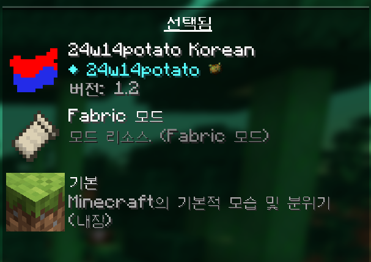

# 24w14potato-Korean-Localization

 
만우절 24w14potato버전 한국어 번역팩

 

## 적용법
리소스팩으로 불러와 주시면 됩니다.  
`설정`에서 `리소스팩`으로 들어간 후  
팩 폴더에 리소스팩 파일을 집어넣어 가져오거나  
화면 밖에서 드래그 앤 드랍으로 가져오실 수 있습니다.  
 

 

## 사용 시 참고사항

- 파일 공유는 가능하면 삼가해주세요.
- 번역 오류나 더 나은 제안이 있다면 [Issues](https://github.com/DominoKorean/24w14potato-Korean-Localization/issues)에서 해주시면 됩니다.